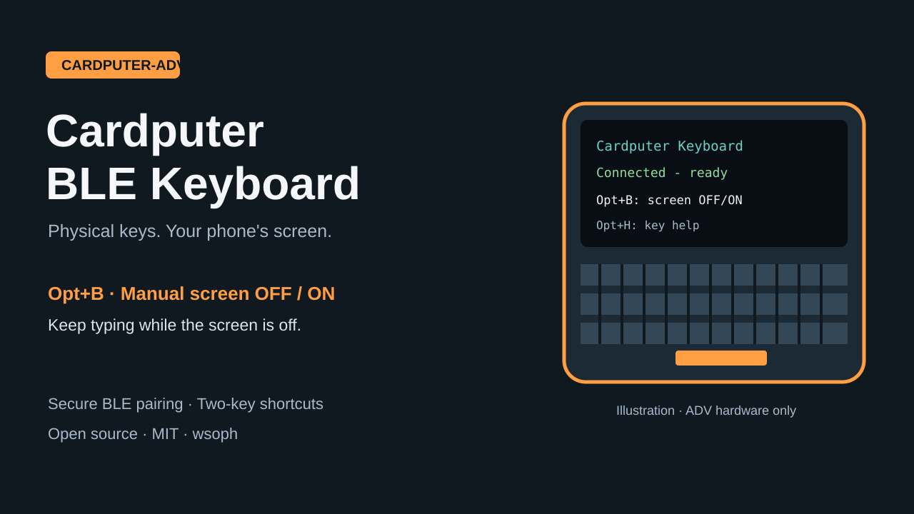

# Cardputer BLE Keyboard

Turn an **M5Stack Cardputer-ADV** into a Bluetooth keyboard for your phone. Version **0.1.4**.

把 **M5Stack Cardputer-ADV** 变成手机蓝牙键盘。标准 BLE HID，无需配套应用、服务器、Wi-Fi 或 SD 数据文件。当前仅支持 **ADV**，不支持初代 Cardputer。



## Install / 安装

Download from [Releases](https://github.com/wsoph/cardputer-ble-keyboard/releases).

| File | Installation |
|---|---|
| `cardputer-keyboard-0.1.4-app.bin` | **M5Launcher + SD**: copy to SD `/firmware/`, select the file and Install. Use an available app slot and preserve other apps. |
| `cardputer-keyboard-0.1.4-standalone-8mb.bin` | **Standalone / M5Burner**, address `0x0000`. Replaces Launcher, existing apps and settings; not a Launcher app file. |

推荐 Launcher 用户使用 app.bin 经 SD 安装。独立启动镜像供 M5Burner 使用，会替换 Launcher、其他应用及设置。包内有 SHA-256 校验和调试文件；独立镜像由干净构建产物合并，不从已使用的设备导出。

## Pair / 配对

1. Press **Opt+P**, release **ALL** keys, then **Enter**. Look for `Pairing open`. The window lasts 180 seconds; opening it disconnects an active phone.
2. On the phone, open Bluetooth settings and select **Cardputer Keyboard**.
3. Follow the Cardputer prompt within 30 seconds:
   - **Type phone's 6-digit PIN here**: type the phone's six digits on Cardputer, then Enter. Input is masked; Del erases.
   - **Check PIN matches on both screens**: check the numbers match, press Cardputer Enter, and confirm on the phone if requested.
   - **Enter this PIN on your phone**: enter Cardputer's code on the phone.
4. At `Connected - ready to type`, focus a text field and type. Set the phone's physical keyboard layout to **English (US)**.

按 **Opt+P → 松开全部按键 → Enter** 打开配对，再在手机蓝牙设置选择 **Cardputer Keyboard**。按设备提示输入或核对验证码。实体键盘布局选 **英语（美国）**。Fn+反引号取消验证。

First boot without saved bonds opens pairing automatically. Saved phones can reconnect without a PIN; **new pairing needs an open window**. For error 3 first reopen the window as above. If it persists during the countdown, report the fixed BLE events, without PINs or typed text.

首次无配对记录时自动开放窗口；已配对手机可直接重连。重新配对需先打开窗口，错误 3 时先检查倒计时。

## Use / 使用

| Keys | Action |
|---|---|
| Character keys, Aa + character | US characters; **Aa = Shift** |
| Tab / Enter / Del | Tab / Enter / **Backspace** |
| Ctrl / Alt / Aa | Standard modifiers |
| Fn + `;` / `,` / `.` / `/` | Up / Left / Down / Right |
| Fn + grave/backtick / Fn + Del | Esc / Delete |
| Fn + 1–0, minus, equals | F1–F12 |
| **Opt+C / Opt+V** | Ctrl+Shift+C / Ctrl+Shift+V; copy/paste in supported terminals |
| **Opt+B** | **Manually turn screen OFF / ON; typing continues while dark** |
| **Opt+P**, release, Enter | Open pairing |
| **Opt+H** | Cycle Pair & screen → Basic keys → Daily use → Home |

**Opt+B 手动熄屏／亮屏：按一次关背光，再按一次恢复。熄屏后蓝牙和输入继续工作，无自动熄屏或系统休眠。** All documented operations require at most two simultaneous physical keys.

Chinese uses the phone or target computer's input method. The firmware sends US key events, not Unicode or local Pinyin candidates. Alt+Tab and terminal copy/paste depend on the OS and app. Offline input is discarded; after reconnect, release all keys before typing.

中文使用手机或目标电脑输入法，固件不内置拼音选字。系统快捷键取决于应用和系统。断线输入不会重放；重连后先松开所有键。

## Build / 构建

Install Python and [PlatformIO Core](https://docs.platformio.org/en/latest/core/installation/index.html):

```sh
python -m pip install platformio==6.1.18
python -m platformio run -e cardputer-ble-keyboard
```

Output: `.pio/build/cardputer-ble-keyboard/`. Dependencies are pinned in `platformio.ini`. PowerShell: `./Build-Keyboard.ps1`; optional `-Python`, `-CoreDirectory`, `-BuildDirectory`, `-LibraryDirectory` select external paths.

Native C++17 checks:

```sh
c++ -std=c++17 -Wall -Wextra -Werror -I include test/test_keyboard.cpp src/keyboard_core.cpp src/pairing_prompt.cpp -o /tmp/cardputer-keyboard-tests
/tmp/cardputer-keyboard-tests
```

Windows: `./Test-Keyboard.ps1 -Compiler clang++`, or `./Test-Keyboard.ps1 -Compiler zig -Zig`. Optional `-BuildDirectory` selects output.

Package with `./Package-Keyboard.ps1`; see [release instructions](docs/RELEASING.md). Packaging never flashes a device.

## Validation and contribution

0.1.3: user-confirmed pairing, ordinary input, and steady screen on ADV with Honor 400 Pro. 0.1.4 updates instructions and portable tooling; see [validation](docs/VALIDATION.md) for its device acceptance and standalone boot status. Builds do not verify radio/LCD behavior.

See [CONTRIBUTING](CONTRIBUTING.md), [architecture](docs/ARCHITECTURE.md), [third-party notices](THIRD_PARTY_NOTICES.md). Project source is **MIT**; dependencies keep their own licenses.

Official references: [Cardputer-ADV](https://docs.m5stack.com/en/core/Cardputer-Adv), [M5Cardputer](https://github.com/m5stack/M5Cardputer), [M5Burner publishing](https://docs.m5stack.com/en/uiflow/m5burner/publish).
